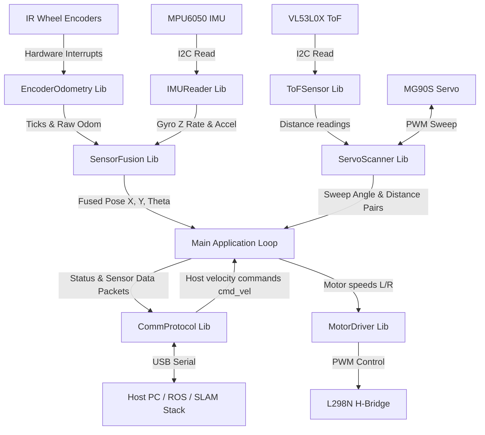

# SLAM-Firmware Architecture

This document describes the software design and architecture of the ESP32 SLAM Robotic Car Firmware.

## System Block Diagram

## Control Loops and Task Scheduling

To achieve real-time responsive execution, the main loop divides execution into discrete, timed intervals (non-blocking scheduler pattern):

1. **High-Frequency Control Loop (50 Hz / 20ms)**:
   - Read MPU6050 gyroscope and accelerometer.
   - Calculate wheel encoder ticks and delta distances.
   - Run the **Sensor Fusion** filter to compute the current pose $(x, y, \theta)$.
   - Update the Motor PID controllers (if implemented) or write direct speeds to the `MotorDriver`.
   
2. **Medium-Frequency Scanning Loop (20 Hz / 50ms)**:
   - Trigger the MG90S servo sweep step.
   - Read the VL53L0X distance.
   - Build angle-distance pairs and buffer them for transmission.

3. **Telemetry & Communication Loop (10 Hz / 100ms)**:
   - Package the current Pose $(x, y, \theta)$, linear/angular velocities, and IMU data.
   - Stream packets to the Host computer via USB Serial.
   - Parse incoming command velocity packet buffer.

4. **Low-Frequency Safety & Diagnostics Loop (1 Hz / 1000ms)**:
   - Check I2C bus health (execute I2C recovery if hung).
   - Check connection timeout (if no `cmd_vel` received from host for $> 2.0$ seconds, trigger Safe-Stop mode).

## Core State Machine

The main program (`src/main.cpp`) operates under a simple, robust state machine:

- **INIT**: Initializes peripherals, runs IMU calibration, starts the ToF sensor, sweeps the servo to $90^\circ$ (center), and sets up interrupts. Transitions to `STANDBY` on success.
- **STANDBY**: Awaiting connection from the Host PC. Motors are off, telemetry is transmitted at low frequency.
- **DRIVING**: Active operating mode. Actively executing motion commands from the Host PC while publishing high-frequency sensor readings.
- **SAFE_STOP**: Triggered by a loss of communication or manual override. The motors are immediately stopped, and the firmware attempts to reconnect.
